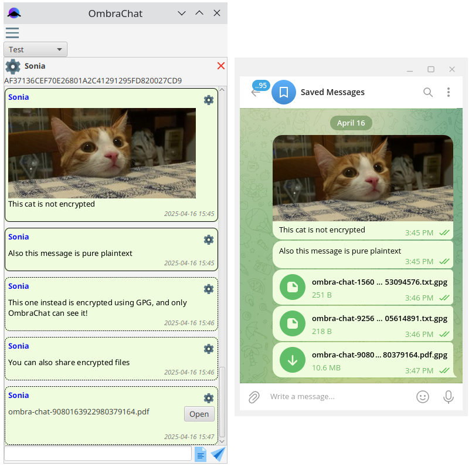
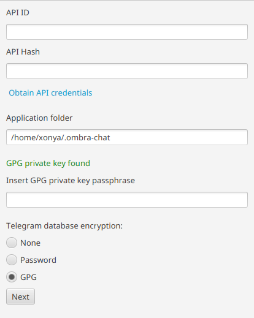
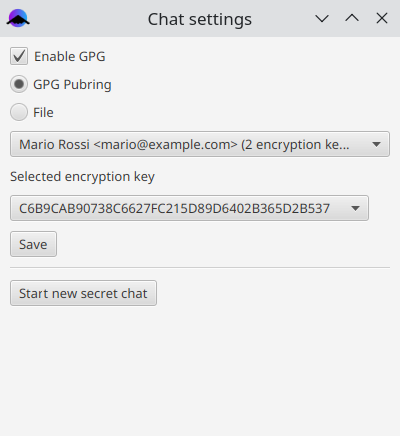

<h1 align="center">
  
  <br>
  OmbraChat
</h1>

<p align="center"><strong>Privacy-focused Telegram desktop client</strong></p>

> ⚠️ Alpha release! Expect to find bugs and missing features!

OmbraChat is a desktop client for Telegram designed for privacy-conscious nerds.

In addition to supporting secret chats and encrypting Telegram's local database, it offers some extra features like:

* The ability for advanced users to associate a GPG key with a user, allowing them to encrypt all standard one-on-one chats (which are not encrypted by default in Telegram). GPG encryption can also be activated within secret chats, providing an additional layer of encryption. Messages sent from a standard Telegram client will appear as .gpg files (see the screenshot below).

* An option to define a default chat group (folder) that is automatically selected when the app starts; this can be useful if you want to hide certain chats from prying eyes when opening the client.



The app named OmbraChat because "ombra" means "shadow" in Italian.

Currently it has been tested only on Linux, but it could work also on other OS.

Have a look at the [changelog](CHANGELOG.md) to see the implemented features.

## Why?

There are numerous open-source messaging applications that offer robust end-to-end encryption support. However, the existence of multiple options often leads to fragmentation, with users reluctant to create numerous accounts. Consequently, even tech-savvy individuals tend to use mostly Telegram, where encrypted chats are not created by default and not supported by the official desktop client.

This alternative client allows us to continue utilizing Telegram's infrastructure while addressing its privacy limitations. While GPG may not be user-friendly and lacks features like forward secrecy, it is still better than standard unencrypted chats. On the other hand, it's nice to have direct control over your keys instead of depending on automatic mechanisms that can be somewhat unclear.

Moreover, switching to alternative clients with their own encryption will create resistance against the rising governmental push to invade our private conversations (yes, I'm looking at you, "Chat Control 2.0").

## Install

Download the zip file attached to the [last release](https://github.com/ombra-chat/ombra-chat/releases). It **should** contain everything you need to start the app, just by executing `./bin/ombrachat`.

You need glib >= 2.35.

Tested on:

* Debian 12
* Ubuntu 24.04

If it doesn't work, try to build the application manually using the instructions below.

## Configure GPG keys

> ⚠️ For expert users only. The current procedure is cumbersome; it will probably be simplified in the future.

The app uses the Bouncy Castle library to perform PGP encryption. It tries to load the keys from your pubring (`~/.gnupg/pubring.kbx`), but if something goes wrong (and it happens in some gpg versions) you can still select the key files manually.

### Setup your private key

> ⚠️ Currently this should be done during the initial configuration.

> ⚠️ Integration with GPG pinentry (the GPG app that prompts for the passphrase) is not currently supported and Bouncy Castle needs your private key passphrase to decrypt your data. So, the suggested procedure is to create a **dedicated key** for OmbraChat, as you will need to copy it to the app folder and provide the passphrase to the app when it starts.

Create your key:

```bash
gpg --quick-gen-key yourname@ombrachat future-default default
```

Note: `future-default` is used to select ECC algorithms, but RSA can be used too.

Create OmbraChat folder:

```bash
mkdir -p ~/.ombra-chat/gpg
```

Export your private key:

```bash
gpg --armor --export-secret-key yourname@ombrachat > ~/.ombra-chat/gpg/private.asc
```

The file `~/.ombra-chat/gpg/private.asc` is checked during the initial configuration of the application. If a valid private key is found you can also enable GPG encryption of the tdlib database. This works by generating a random password and then encrypting it with your key.



Optionally, but suggested, you should sign this key with your primary certification key before sending it to your friends, so that they can validate its autenticity:

```bash
gpg --sign-key yourname@ombrachat
```

Export your public key to a file and send it to your friend:

```bash
gpg --armor --export yourname@ombrachat > public.asc
```

Share the `public.asc` to your friend using a trusted channel.

### Associate a chat with a public key

Assuming that you have recieved a file `public.asc` from your friend, you should import it into your pubring:

```bash
gpg --import public.asc
```

Then, you can associate it from the app, just by clicking on the gear icon on the top of the chat. If something goes wrong reading your pubring you can manually select the file.



### Replace your private key

If you need to replace your private key, just repeat the procedure above and export the private key to a file named `private.asc.new`. Restart the app and it should automatically detect that you want to replace your key. This will regenerate the tdlib database GPG encrypted password, if present.

Notice that you will not be able to decrypt old messages when you change the key.

## Application data

The application stores its data in a folder that can be configured during the first setup. The default location is `~/.ombra-chat`.

Preferences are stored in `~/.java/.userPrefs/net/zonia3000/ombrachat/services/prefs.xml`.

## Build

> ⚠️ **Important**: in order to properly run the jlink build you need to use OpenJDK and **not** Oracle JDK.

Install [OpenJDK 21](https://jdk.java.net/java-se-ri/21) and maven.

Install `libtdjni.so` and `tdlib.jar` from https://github.com/ombra-chat/tdlib-java (or build your own version).

To build and run:

```bash
mvn clean javafx:run
```

### JLink build

In order to use jlink to build a self-contained runtime image, it is necessary to run the `./lib/patch-modules.sh` script.

Them, use the following command to build:

```bash
mvn clean javafx:jlink
```

The program can then be started executing `./target/ombrachat/bin/ombrachat`.

## Debug

To enable the debug logging you can start the app setting the environment variable `LOG_LEVEL=DEBUG`. Notice that this will also generate a `tdlib.log` file which can be very verbose and will contain sensitive data in plaintext.

To debug the application attaching the debugger to the JPDA socket start it using:

```bash
mvn clean javafx:run@debug
```

## Troubleshooting

### no tdjni in java.library.path

If you encounter an error like:

```
java.lang.UnsatisfiedLinkError: no tdjni in java.library.path: /usr/java/packages/lib:/usr/lib/x86_64-linux-gnu/jni:/lib/x86_64-linux-gnu:/usr/lib/x86_64-linux-gnu:/usr/lib/jni:/lib:/usr/lib
```

You need to copy the `libtdjni.so` to one of the locations specified in the error.

## License

OmbraChat is released under GPLv3.

The app is based on [tdlib](https://github.com/tdlib/td) released with Boost Software License - copyright Aliaksei Levin (levlam@telegram.org), Arseny Smirnov (arseny30@gmail.com) 2014-2025
