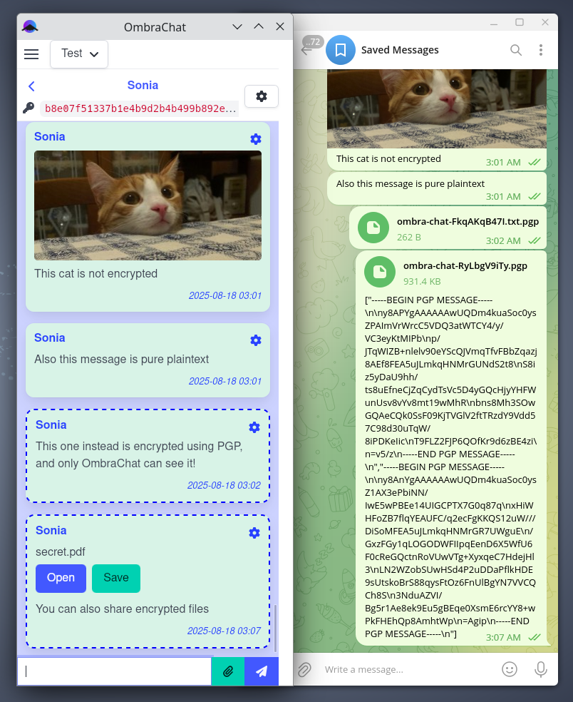
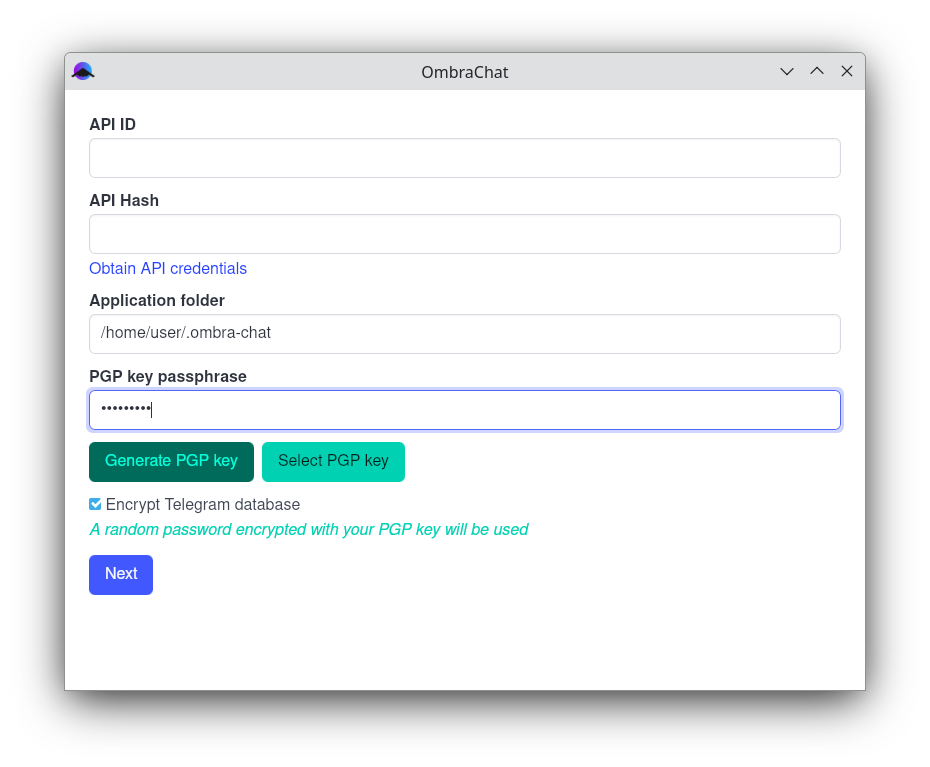
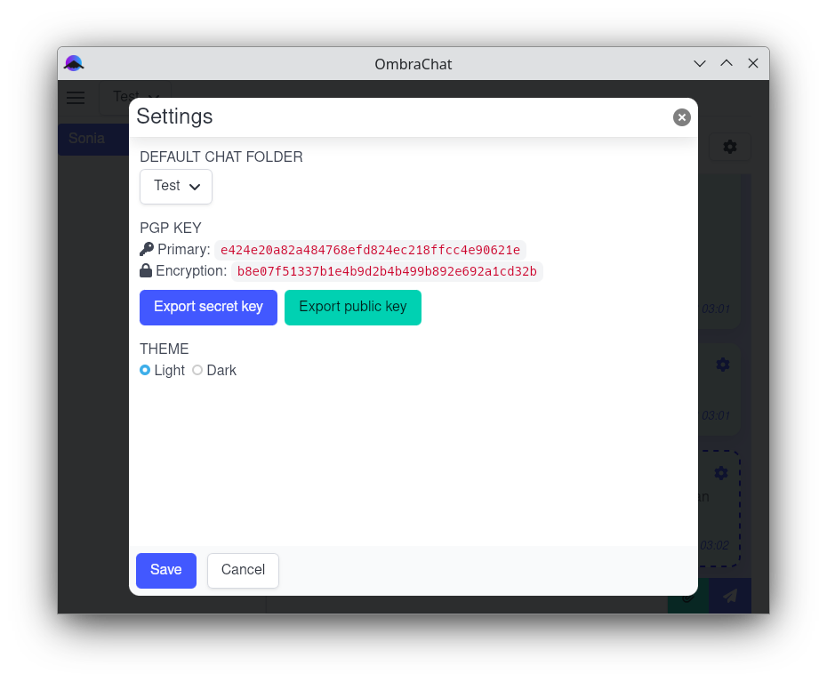
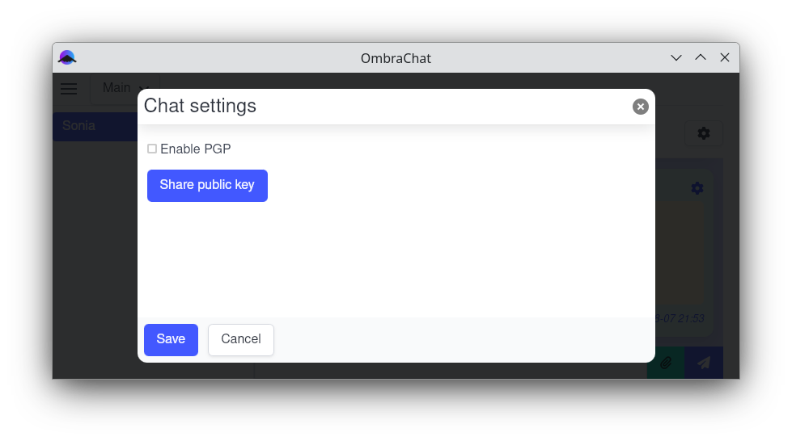
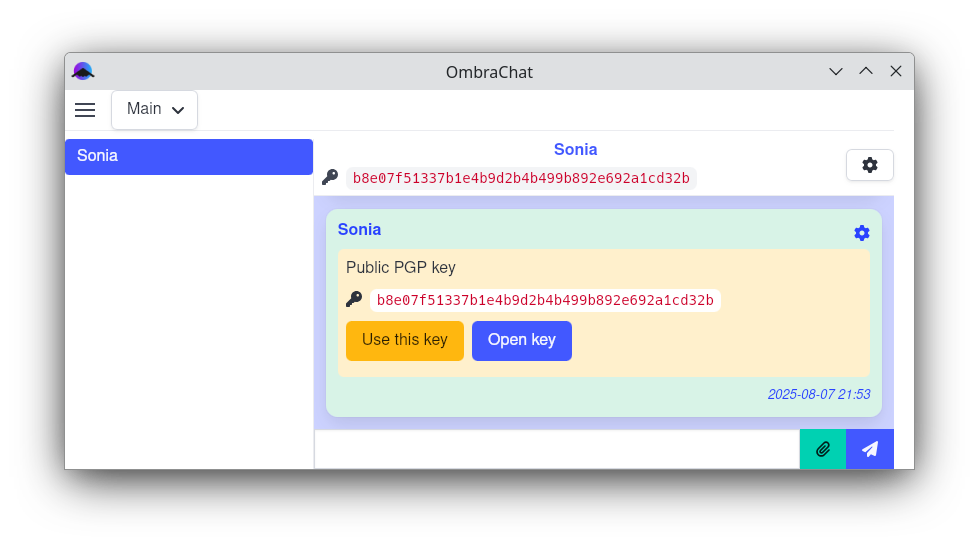

<h1 align="center">
  
  <br>
  OmbraChat
</h1>

<p align="center"><strong>Privacy-focused Telegram desktop client</strong></p>

> ⚠️ Alpha release! Expect to find bugs and missing features!

OmbraChat is a desktop client for Telegram designed for privacy-conscious nerds.

In addition to supporting secret chats and encrypting Telegram's local database, it offers some extra features like:

* The ability to associate a PGP key with a user, allowing to encrypt all standard one-on-one chats (which are not encrypted by default in Telegram). PGP encryption can also be activated within secret chats, providing an additional layer of encryption. Messages sent from a standard Telegram client will appear as .pgp files (see the screenshot below).

* An option to define a default chat group (folder) that is automatically selected when the app starts; this can be useful if you want to hide certain chats from prying eyes when opening the client.

Following screenshot displays how the PGP messages are seen in OmbraChat and in the standard Telegram client:



> ⚠️ **Disclaimer**: this app is currently a pet project and I'm not a cryptographer, so do not rely on it for highly sensitive data.

The app is named OmbraChat because "ombra" means "shadow" in Italian.

Currently it has been tested only on Linux, but it could work also on other OS.

Have a look at the [changelog](CHANGELOG.md) to see the implemented features.

## Why?

There are numerous open-source messaging applications that offer robust end-to-end encryption support. However, the existence of multiple options often leads to fragmentation, with users reluctant to create numerous accounts. Consequently, even tech-savvy individuals tend to use mostly Telegram, where encrypted chats are not created by default and not supported by the official desktop client.

This alternative client allows us to continue utilizing Telegram's infrastructure while addressing its privacy limitations. While PGP may not be user-friendly and lacks features like forward secrecy, it is still better than standard unencrypted chats. On the other hand, it's nice to have direct control over your keys instead of depending on automatic mechanisms that can be somewhat unclear.

Moreover, switching to alternative clients with their own encryption will create resistance against the rising governmental push to invade our private conversations (yes, I'm looking at you, "Chat Control 2.0").

## Install

Check the [last release](https://github.com/ombra-chat/ombra-chat/releases) for some pre-built binaries.

If you install the .deb or .rpm you will also need the libtdjson.so file. You can download it from the release page and copy it into `/usr/lib` or other proper location.

If you are using Wayland, install the .deb or .rpm rather than the AppImage, since Tauri's AppImage doesn't work well with Wayland (see https://github.com/tauri-apps/tauri/issues/11790).

## Configure PGP keys

### Setup your private key

During the initial configuration the app generates a PGP keypair for you. You should provide a password to encrypt the key. You have to insert this password to decrypt the key every time the app is started.



The keypair uses Curve25519 and is generated using [rPGP](https://github.com/rpgp/rpgp). You can also import an externally generated key, but consider that keys generated with GnuPG may not be fully compatible. The purpose of the "Select PGP key" button is mostly to import a key generated with OmbraChat on a different device.

Once the app is started, you can export your key from the settings modal:



### Associate a chat with a public key

To share your public key to a friend, go to their chat, open the chat settings modal and click on the "Share public key" button.



A special message is sent. Your friend can accept the key directly on the "Use this key" button. The new messages will be encrypted using that key. Your friend has to share their key too and you have to accept it. Ideally, you should check the keys on an external trusted channel.



It is also possible to manually import a key from file.

## Application data

The application stores its data in a folder that can be configured during the first setup. The default location is `~/.ombra-chat`.

Preferences are stored in `~/.local/share/net.zonia3000.ombra-chat`.

## Developing

Build tdlib using following instructions: https://tdlib.github.io/td/build.html?language=C

Clone tdlib-rs in a folder at the same level of the ombra-chat repo folder:

```sh
git clone https://github.com/ombra-chat/tdlib-rs.git
```

Install [Tauri prerequisites](https://v2.tauri.app/start/prerequisites/), then clone this repo and install the app dependencies:

```bash
git clone https://github.com/ombra-chat/ombra-chat.git
cd ombra-chat
npm install
```

To run in developer mode:

```bash
npm run tauri dev
```

To build release packages:

```bash
npm run tauri build
```

## Debug

To enable the debug logging you can start the app setting the environment variable `RUST_LOG=ombra_chat_lib=trace`. Notice that this will also generate a tdlib logs, which can be very verbose and will contain sensitive data in plaintext.

## License

OmbraChat is released under GPLv3.

The app is based on [tdlib](https://github.com/tdlib/td) released with Boost Software License - copyright Aliaksei Levin (levlam@telegram.org), Arseny Smirnov (arseny30@gmail.com) 2014-2025
